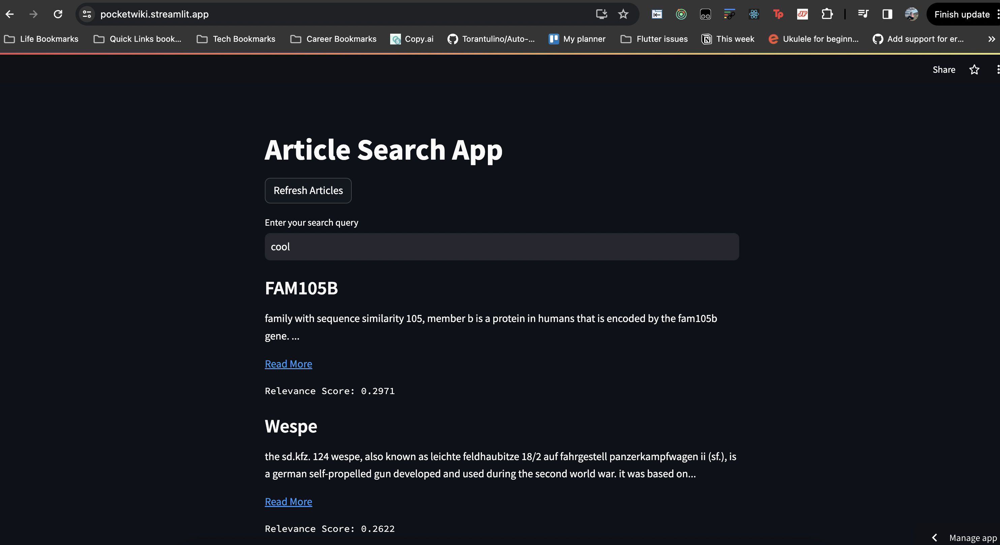

# PocketWiki - Your Wikipedia Article Search App

PocketWiki is a user-friendly app that allows you to search for Wikipedia articles with ease. It provides a simple interface for querying Wikipedia articles and displays the most relevant results based on your search query. With the option to refresh the article base, PocketWiki ensures that you have access to a fresh set of articles whenever you need them.



## Features

- **Search for Wikipedia Articles:** Enter your search query in the user-friendly interface to find relevant Wikipedia articles.

- **Article Summaries:** View article titles, brief summaries, and links to the full Wikipedia articles.

- **Refresh Articles:** Keep your article base up-to-date by clicking the "Refresh Articles" button to fetch new random Wikipedia articles.

- **Efficient Article Retrieval:** PocketWiki avoids unnecessary re-downloading of articles, ensuring a smooth user experience.

- **Deployed Version:** A deployed version of PocketWiki is available at [pocketwiki.streamlit.app](https://pocketwiki.streamlit.app). Explore it to access the full functionality of the app!


## Technical Approach

PocketWiki is built using several key technical components and a thoughtful approach to deliver an efficient and user-friendly Wikipedia article search experience.

I initially started with indexing the articles, after removing stopwords, punctuations etc and cleaning the data and then matching user query with the indexed list of articles on the basis of word occurence, however, due to the small base of 200 articles this did not yield good results. Hence, the following technical approach was implemented

**1. Retrieval of Wikipedia Articles:**
- We use the Wikipedia API to fetch 200 random Wikipedia articles at the start of the application. These articles serve as the initial dataset for user searches.

**2. Natural Language Processing (NLP) Techniques:**
- To calculate the relevance of articles to a user's query, we leverage the Sentence Transformers library. This library allows us to convert article titles into high-dimensional vectors that capture semantic information.
- For the user's search query, we similarly encode it into a vector. By comparing these vectors, we can determine the similarity (relevance) between the query and articles.

**3. User Query Processing:**
- When a user enters a search query, we encode the query into a vector representation using the same Sentence Transformers model.
- We then compute the cosine similarity between the query vector and all article vectors. The articles with the highest cosine similarity scores are considered the most relevant to the query.

**4. Efficient Article Base Management:**
- To ensure efficient resource usage and avoid re-downloading articles unnecessarily, we store the fetched articles in a session state variable. This means that articles are downloaded only once when the app is initially run or when the user explicitly refreshes the articles.
- This approach reduces API calls and improves app performance.


## How to Run PocketWiki Locally

To run PocketWiki on your local machine, follow these steps:

1. **Clone the Repository:**
   - Clone the PocketWiki repository or download the source code to your local machine.

2. **Navigate to the Project Directory:**
   - Open a terminal or command prompt and navigate to the directory where you cloned or downloaded the project.

3. **Create a Virtual Environment (Recommended):**
   - Run `python -m venv venv` to create a virtual environment (replace `python` with `python3` if needed).
   - Activate the virtual environment:
     - On Windows: `venv\Scripts\activate`
     - On macOS/Linux: `source venv/bin/activate`

4. **Install Dependencies:**
   - With the virtual environment activated, install the required packages by running:
     ```
     pip install -r requirements.txt
     ```

5. **Run the Streamlit App:**
   - After successfully installing the dependencies, run your Streamlit app with:
     ```
     streamlit run app.py
     ```
   - Your default web browser should automatically open with the app running. If not, follow the URL provided in the terminal.

## Deployed Version

PocketWiki is also available as a deployed version at [pocketwiki.streamlit.app/](https://pocketwiki.streamlit.app/). You can explore the app online and use it without the need for local setup.

---

Enjoy using PocketWiki to search for Wikipedia articles effortlessly! If you encounter any issues or have feedback, please don't hesitate to reach out.

[Visit PocketWiki](https://pocketwiki.streamlit.app)
